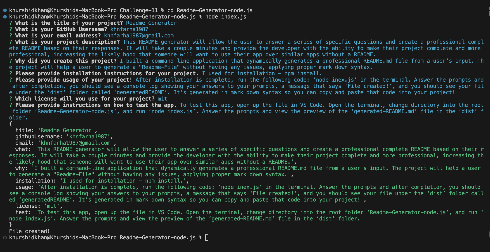

# Working with ES6 & Node.js: Professional README Generator
Challenge 11 : In this Challenge, we'll build a command-line application that dynamically generates a professional README.md file from a user's input.

# User Story:
  * AS A developer
  * I WANT a README generator
  * SO THAT I can quickly create a professional README for a new project

# Project Requirements:
  * Create a command-line application that accepts user input.
  
  * When a user is prompted for information about the application repository, a high-quality, professional README.md is generated with:
    * The title of my project
    * Sections entitled-
    * Description
    * Table of Contents
    * Installation
    * Usage
    * License
    * Contributing
    * Tests
    * Questions
  
  * When a user enters the project title, it's displayed as the title of the README.
  
  * When a user enters a description, installation instructions, usage information, contribution guidelines, and test instructions, this information is added to the sections of the README entitled Description, Installation, Usage, Contributing, and Tests.
  
  * When a user chooses a license for their application from a list of options, a badge for that license is added near the top of the README and a notice is added to the section of the README entitled License that explains which license the application is covered under.
  
  * When a user enters their GitHub username, it's added to the section of the README entitled Questions, with a link to their GitHub profile.
  
  * When a user enters their email address, it's added to the section of the README entitled Questions, with instructions on how to reach them with additional questions.
  
  * When a user clicks on the links in the Table of Contents, they are taken to the corresponding section of the README.    
  
# Project Description:
  * My project is a Professional README Generator. The project will help a user to generate a "Readme-File" without having any issues, applying proper mark down syntax.
  
  * This README generator will allow the user to answer a series of specific questions and create a professional complete README based on their responses. It will take a couple minutes and provide the developer with the ability to make their project complete and more professional, increasing the likely hood that someone will want to use their app over similar apps without a README.
  
  * It will take user's input and create a quality README file with sections like: The title of my project, Sections entitled, Description, Table of Contents, Installation, Usage, License, Contributing, Tests, Questions.
  
  * This README file was created with this app, however manual changes have been added. We can see all the changes "generated-READMe.md" file.
  
  # Image Links of this Project:
 

# Video Links of this Project:
   
   

# Table of Contents
- [Working with ES6 \& Node.js: Professional README Generator](#working-with-es6--nodejs-professional-readme-generator)
- [User Story:](#user-story)
- [Project Requirements:](#project-requirements)
- [Project Description:](#project-description)
- [Image Links of this Project:](#image-links-of-this-project)
- [Video Links of this Project:](#video-links-of-this-project)
- [Table of Contents](#table-of-contents)
  - [Installation:](#installation)
  - [Usage:](#usage)
  - [License:](#license)
  - [Contributing:](#contributing)
  - [Tests:](#tests)
  - [Questions:](#questions)
- [Application GitHub URL:](#application-github-url)
- [Application Deployed live URL:](#application-deployed-live-url)

 
## Installation:
  * Make sure that your repo includes a package.json with the required dependencies. 
  
  * We can create one by running by this command when you first set up the project, before installing any dependencies.
   ```
  npm init
  ```
  * To install necessary dependecies, run the following command:
  ```
  npm install
  ```

## Usage:
After installation is complete, run the following code: ‘node inex.js’ in the terminal. Answer the prompts and after completion, you should see a console log showing your answers to your prompts, a message that says ‘File created!’, and you should see your file under the ‘dist’ folder called ‘generatedREADME’. It’s generated in mark down syntax so you can copy and paste that code into your project!

## License:
This readme-generator-project uses the "MIT" license.

 ## Contributing:
 Thank you for your interest in helping out; Pull requests are welcome. For major changes, please open an issue first to discuss by send email, what you would like to change.

## Tests:
To test this app, open up the file in VS Code. Open the terminal, change directory into the root folder ‘Readme-Generator-node.js’, and run ‘node index.js’. Answer the prompts and view the preview of the ‘generated-README.md’ file in the ‘dist’ folder.
    
## Questions:
Please contact me if you have any questions, using the following links:

  [GitHub](https://github.com/khnfarha1987)

  [Email: khnfarha1987@gmail.com](mailto:khnfarha1987@gmail.com)


# Application GitHub URL:
[README Generator GitHub Link](https://github.com/khnfarha1987/Readme-Generator-node.js)


# Application Deployed live URL:
[README Generator Deployed Link](https://khnfarha1987.github.io/Readme-Generator-node.js/)

